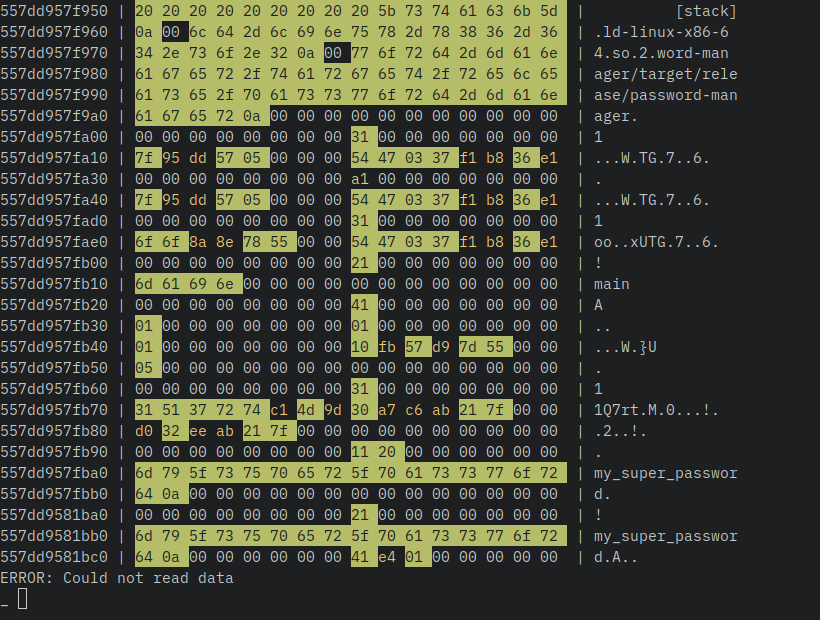

# memscan

```
Dump the heap of a given process

Usage: memscan [OPTIONS] <PROCESS_NAME>

Arguments:
  <PROCESS_NAME>  Name of the target process

Options:
  -a, --ascii            Show the dump in ascii
  -z, --hide-zero-lines  Hide lines containing only zeroes
  -h, --help             Print help
  -V, --version          Print version
```



## Installation
```bash
git clone https://github.com/charyan/memscan.git
```

## Usage
### Start the password manager
```bash
cd password-manager
cargo run --release -q
```

### Start the memory scanner
```bash
cd memscan
cargo build --release
sudo target/release/memscan password-manager -za
```

